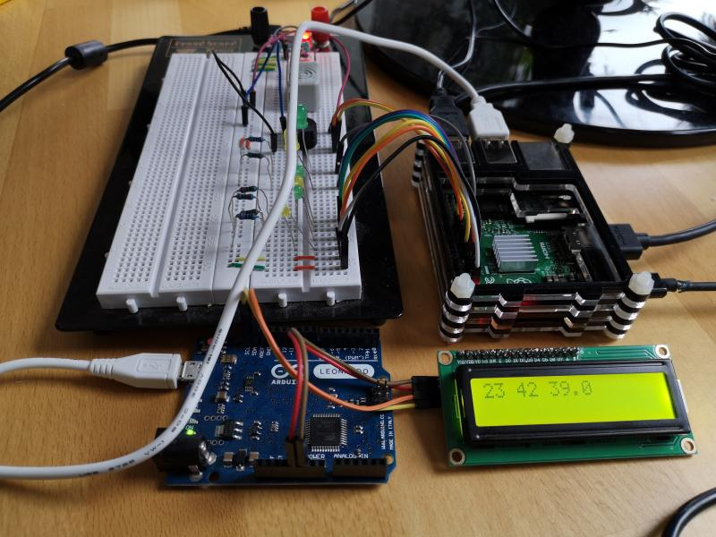

## CraftBeerPi3 SerialSensors Plugin

### Introduction
SerialSensors is a plugin for [CraftBeerPi3 (CBP3)](https://github.com/Manuel83/craftbeerpi3) that sends all sensor data via serial console; e.g. to an arduino.

### HowTo
Clone or download/unzip to your *craftbeerpi3/modules/plugins/* directory, restart: *sudo /etc/init.d/craftbeerpiboot restart*, and also reload on web application side.

Select **SerialSensors** as a *passive sensor*. It searches for */dev/ACMX* (X:={0,1,2,..,N-1} and let you select the *baud rate* and to which connected arduino to talk to.

By default this sensor adds the system temperature as an own value. If you *hide* this sensor it should not add the system's temperature.

### Data
All sensor data is sent out as: "sensorValue1 sensorValue2 sensorValue3 sensorValueN", currently seperated by a whitespaces. For example: "55.1 63 72.2 78.3".

### Visualization
Connect an arduino via USB port to one of *craftBeerPi's* USB ports. Flash the *LiquidCrystal - Serial Input* example, connecting some 20x2 LCD display to arduino - done.

### Processing
However you can process the sensor data for an own application using arduino and some electronics.

have fun.

## ChangeLog

The date string implies the version of the plugin

**29032020**
  - set up repository, added readme and photo,
  - added menu to select the baud rate the arduino runs on,
  - fixed bug on closing serial console while *stop* or *shutdown*.

**28032000**
  - added menu to detect and select the port of the serial console,
  - set up files and first test runs on openingn serial console to arduino,
  - crawled through CraftBeerPi3 to understand data structures.
